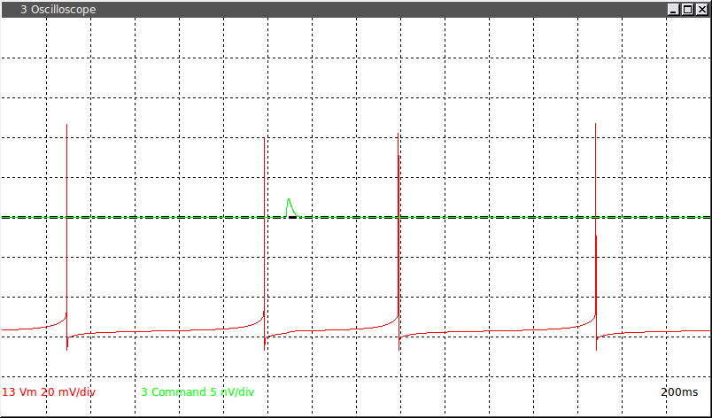
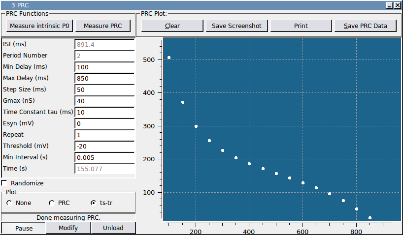

###Phase Response Curve

**Requirements:** None  
**Limitations:** None  

This module applies an alpha-shaped conductance to the cell at a fixed delay after 10 interspike intervals (ISI). It computes an intrinsic period P0 by averaging the most recent 5 of 10 ISIs. Thus, the value of P0 can change over time. The period after the perturbed period is designated as P1 and the period following P1 is designated as P2. The first and second order PRCs are computed as PRC1=(P1-P0)/P0 and PRC2=(P2-P0)/P0. By this convention, a delay in the spike yield a positive value and an advance yields a negative value. The phase of the perturbation stimulus is computed based on the most recent measured P0. To help you choose the fixed delay for the perturbations, use the “Measure intrinsic P0″ at the top of the module to begin computing a running average of measured ISIs. After you start running the module, the ISI textbox will simply display the current measured ISI. To run a PRC protocol by stepping through the specified fixed delays, click the “Measure PRC” button. Stop either mode of data collection by clicking the “Pause” button. The source code is heavily commented and the program logic is based on indexing the number of spikes that have occurred in each stimulus cycle. It is easy to change how the intrinsic period is computed and whether it is held constant during the entire experiment or recomputed. Similarly, you can easily change the sign convention for computing the phase shifts and extend the code to compute other phase response measures.

This screenshot was made using the Connor Stevens model to generate spikes. A complete demo is available for re-creating this screenshot. 

This module has a second plotting mode that creates a ts-tr plot of the stimulus times and response times for the perturbed period.

